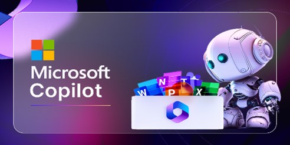
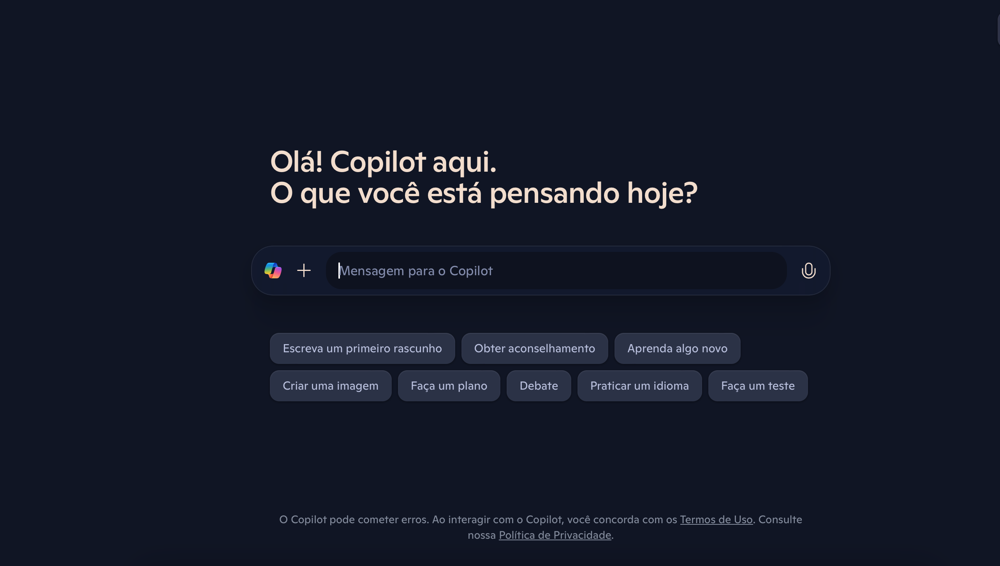
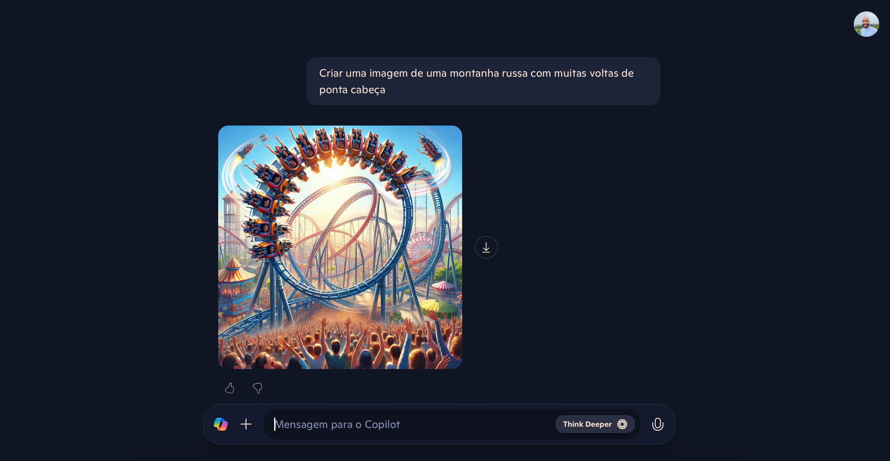
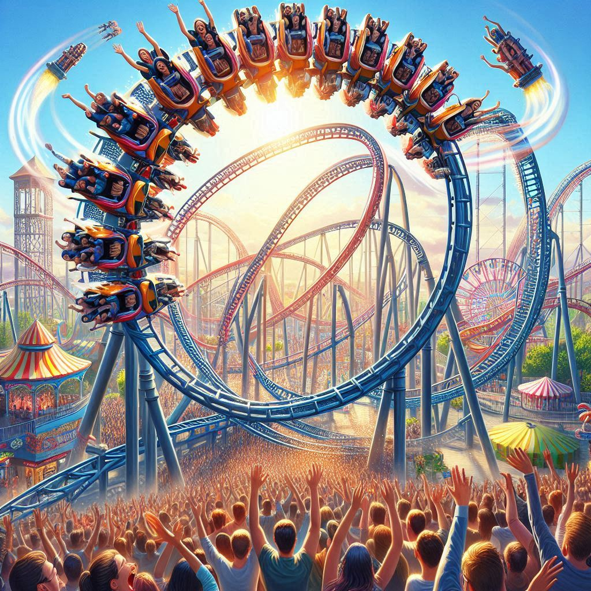

# Explorando os Recursos de IA Generativa com Copilot e OpenAI
<h1 align="center">
    

## Descrição do Projeto
 
 Esse projeto irá testar e entender o poder das IA generativa da Microsoft Copilot e OpenAI, através de uma série de interações, para entender melhor como elas funcionam e como podem ser aplicadas para gerar resultados satisfatórios em diferentes contextos.
 No final do repositório será mostrado uma imagem desenvolvida pela Microsoft Copilot, através de um texto descrevendo os detalhes de como desejo que essa foto seja gerada.
 

### Estruturação desse repositório:

**Inputs**: com a imagem utilizada.

**output**: com o texto para desenvolver a imagem.

### Aprendizados durante o desenvolvimento do projeto:

Foi muito rico aprender novos conceitos sobre IA Generativa, Microsoft Copilot e Open AI.
- Microsoft Copilot, utiliza a IA para ajudar com tarefas, podendo sugerir muitas funcionalidades;
- OpenAi, está por trás pelo desenvolvimento de modelos de IA, fornecendo ferramentas que vão ser úteis em muitas aplicações;
- IA Generativa é um tipo de inteligência artificial que consegue criar algo novo com base nos dados ou informações que recebe. Como em relação ao que será apresentado nesse projeto, um texto com descrição orientando como quero que uma imagem seja gerada. 

### Capturas de Tela 

####  1. Microsoft Copilot, para a criação do prompt de comando
<h1 align="center">
    
</h1>

#### 2. IA Generativa fornecendo a imagem que pedi através de texto
<h1 align="center"> 
    
</h1>

#### 3. Imagem gerada
<h1 align="center"> 
    
</h1>

## Conclusão

O processo de gerar uma imagem no Microsoft Copilot pode parecer simples, no entanto, o que está por trás para esse processo funcionar, envolve muitas camadas. Nesse caso, a Microsoft Copilot facilitou a criação de prompts precisos para que a OpenAI pudesse criar uma forma a partir do texto que digitei, através do DALL-E, criando uma visualmente uma imagem a partir das instruções fornecidas.

